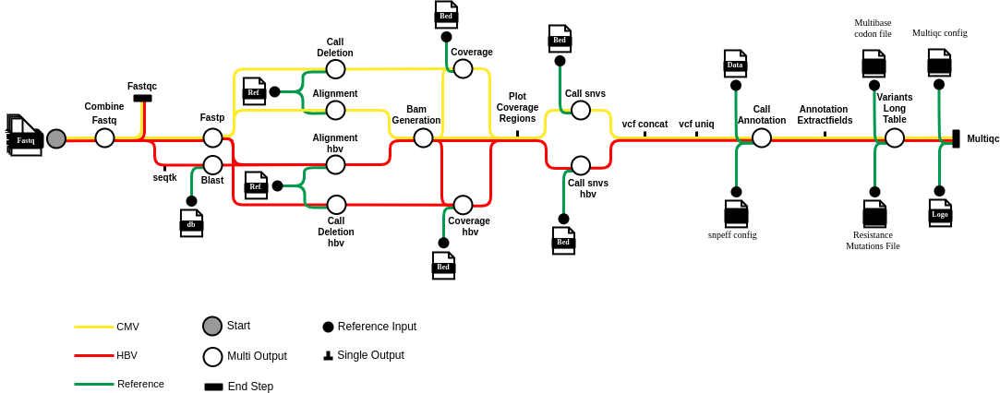

# Viro-Metagenomics Pipeline

[](https://www.nextflow.io/)[](https://www.bioinformatics.babraham.ac.uk/projects/fastqc/)[](https://github.com/lh3/minimap2)[](http://pcingola.github.io/SnpEff/)[](http://www.htslib.org/)[](http://pcingola.github.io/SnpEff/)[](https://github.com/nanoporetech/medaka)[](https://csb5.github.io/lofreq/)[](https://github.com/epi2me-labs/fastcat)[](https://github.com/brentp/mosdepth)[](https://github.com/OpenGene/fastp)[](http://www.htslib.org/)[](https://github.com/vcflib/vcflib)[](https://multiqc.info)[](https://www.docker.com/)


This repository contains the custom bioinformatics pipeline developed for hepatitis B virus (HBV) and cytomegalovirus (CMV) antiviral resistance genotyping. The pipeline is designed to process next-generation sequencing (NGS) data and automate the reporting of HBV genotype and antiviral drug resistance (AVDR), as well as CMV AVDR.

## Overview

The pipeline was developed using [Nextflow](https://github.com/nextflow-io/nextflow). It processes FASTQ files and generates reports on HBV and CMV genotyping and AVDR using using [MultiQC](https://github.com/MultiQC/MultiQC). The pipeline includes several modules for quality control, sequence alignment, variant calling, and annotation. The pipeline supports both HBV and CMV analysis with specialized workflows for each virus type.

### Key Features

- Quality Control: Uses fastqc and fastp for quality filtering and trimming of sequencing reads.
- Sequence Alignment: Aligns reads to reference genomes using minimap2 and samtools.
- Variant Calling: Identifies single nucleotide variants (SNVs) with lofreq and insertions/deletions (indels) with medaka.
- Annotation: Annotates variants using snpEff and generates summary reports with MultiQC.

## Pipeline Components



| Group | Software | Version |
|-------|----------|---------|
| FastQC | fastqc | 0.11.9 |
| Workflow | Nextflow | 24.04.4 |
| Workflow | ph-metagenomics | 1.0.0 |
| alignment | minimap2 | 2.17-r941 |
| annotation_extractfields | snpsift | 4.3 |
| bam_generation | samtools | 1.17 |
| call_annotation | snpeff | 5.1d |
| call_deletions | medaka | 1.4.4 |
| call_snvs | lofreq | 2.1.5 |
| combine_fastq | fastcat | 0.10.2 |
| coverage | mosdepth | 0.3.3 |
| dumpsoftwareversions | python | 3.11.4 |
| dumpsoftwareversions | yaml | 6.0 |
| fastp | fastp | 0.23.2 |
| variants_long_table | python | 3.9.9 |
| vcf_concat | bcftools | 1.17 |
| vcf_uniq | vcflib | 1.0.3 |

## Pipeline Parameters

Pipeline parameters can be configured in the [nextflow.config](nextflow.config) file. The following parameters are available:

- General Parameters
  - `q_score`: Quality score threshold for variant calling (default: 10)
  - `percent_mutations`: Minimum frequency threshold for mutation detection (default: 0.015 or 1.5%)
  - `percent_mutations_clinical`: Minimum frequency threshold for clinical reporting (default: 0.015 or 1.5%)
  - `medakaModel`: Medaka model for variant calling, specific to Oxford Nanopore data (default: 'r941_min_fast_g303')
- Genome-Specific Parameters
  - CMV Analysis
    - `referenceBase`: Path to CMV Merlin reference FASTA file
    - `referenceGenbank`: Path to CMV Merlin GenBank file
    - `ampliconBed`: Path to CMV amplicon BED file
    - `snpeff_database`: Path to SnpEff database
    - `snpeff_config`: Path to SnpEff configuration file
    - `resistance_mutations_file`: Path to CMV resistance mutations CSV file
    - `multibase_codon_file`: Path to CMV codon bases CSV file
  - HBV Analysis
    - `referenceBase`: Path to HBV reference files
    - `referenceGenbank`: Path to HBV GenBank file
    - `ampliconBed`: Path to HBV amplicon BED file
    - `snpeff_database`: Path to SnpEff database
    - `snpeff_config`: Path to SnpEff configuration file
    - `resistance_mutations_file`: Path to HBV resistance mutations CSV file
    - `multibase_codon_file`: Path to HBV codon bases CSV file

All reference files are located in the `pipeline-references` directory of this repository.

### Input Files

- Raw sequencing data in `fastq` format (can be gzipped)
- Reference genomes: `nextflow-references` folder includes the references.
- Drug resistance mutations: `nextflow-references` folder includes the drug resistance mutations.
  - `HBV_resistance_mutations.csv`: Contains known HBV drug resistance mutations.
  - `CMV_resistance_mutations.csv`: Contains known CMV drug resistance mutations.
- Sample sheet: A CSV file containing sample IDs, input file paths, and genome type (HBV or CMV). Required columns are `sample_id`, `input_file`, and `genome`. The `genome` column should specify either `hbv` or `cmv`.

    ```csv
    sample_id,input_file,genome
    SAMPLE1,/path/to/sample1_0.fastq.gz,hbv
    SAMPLE1,/path/to/sample1_1.fastq.gz,hbv
    SAMPLE2,/path/to/sample2_0.fastq.gz,cmv
    SAMPLE2,/path/to/sample2_1.fastq.gz,cmv
    SAMPLE2,/path/to/sample2_2.fastq.gz,cmv
    ```

### Output

The pipeline generates the following folder tree containing the results for each sample:

```shell

./outputs/sample_name/
    ├── combinedFastq/       # Combined fastq files
    ├── fastqc/              # Sequence quality reports
    ├── fastp/               # Sequence quality reports
    ├── align/               # Processed BAM files
    ├── variants/            # Called variants (VCF format)
    ├── annotations/         # Variant annotations
    ├── coverage/            # Coverage analysis and plots
    └── report/              # MultiQC report
```

## Usage

This pipeline is designed to be run using Nextflow, which allows for scalable and reproducible data analysis workflows. The pipeline can be executed on a local machine or on cloud platforms such as AWS, GCP, or Azure.

### Running the Pipeline on Local Machine

To run the pipeline, you need to have Nextflow installed and configured on your system.

**Prerequisites:**

- Nextflow: see [Nextflow installation guide](https://www.nextflow.io/docs/latest/install.html).
- Docker: see [Docker installation guide](https://www.docker.com/products/docker-desktop/).

**Steps to run the pipeline:**

1. Clone the repository:

    ```bash
    git clone https://github.com/PHCViro/Viro-Metagenomics
    cd Viro-Metagenomics
    ```

2. Create a sample sheet CSV file with the required format as described above. To use the provided sample sheet, you can use the `sample_sheet.csv` file in the repository. Included sample_sheet.csv is a sample file that contains example entries for both HBV and CMV samples. You can modify it to include your own samples.

3. Update the [nextflow.config](nextflow.config) file with the appropriate settings for your environment.
4. Run the pipeline using Nextflow:

    ```bash
    nextflow -C nextflow.config run main.nf \
      --samples_file sample_sheet.csv \
      --outdir samples/outputs \
      -w ./work
    ```

Results will be stored in the `samples/outputs` directory, and intermediate files will be stored in the `work` directory.
The pipline repots for the included sample sheet are as follows:

| sample_id | report_file | genome | report |
|-----------|------------|---------|---------|
| 20250414CMVpos | samples/input_fastq/20250414CMVpos.fastq.gz | cmv | [report](samples/outputs/20250414CMVpos/report/20250414CMVpos.multiqc_report.html) |
| A_HBV | samples/input_fastq/A_HBV.fastq.gz | hbv | [report](samples/outputs/A_HBV/report/A_HBV.multiqc_report.html) |
| AC_mix_HBV | samples/input_fastq/AC_mix_HBV.fastq.gz | hbv | [report](samples/outputs/AC_mix_HBV/report/AC_mix_HBV.multiqc_report.html) |
| C_HBV | samples/input_fastq/C_HBV.fastq.gz | hbv | [report](samples/outputs/C_HBV/report/C_HBV.multiqc_report.html) |

### Running the Pipeline on cloud Platforms

For detailed information regarding secured Nextflow deployment on MS Azure and infrastructure-as-code see [this article](https://lnkd.in/gabGjJpf). Nextflow can be run on many other cloud platforms, including AWS and GCP. For more information, see the [Nextflow documentation](https://www.nextflow.io/docs/latest/executor.html).

## Citations


```bibtex
@article{hbvcmv_pipeline2025,
    title={},
    author={[Author List]},
    journal={[Journal]},
    year={2024},
    doi={[DOI]}
}
```

For questions or support, please contact Gordon Ritchie at [GRitchie@providencehealth.bc.ca](mailto:GRitchie@providencehealth.bc.ca).